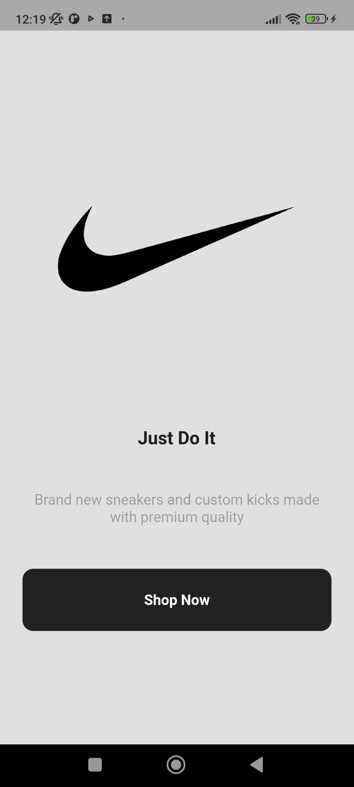
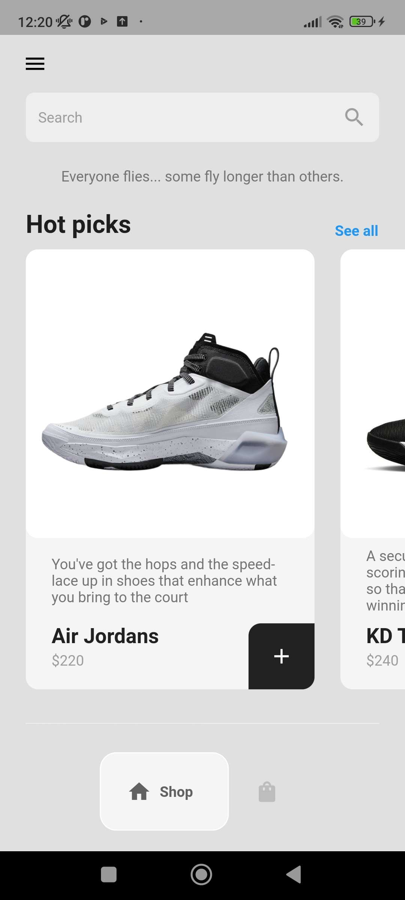
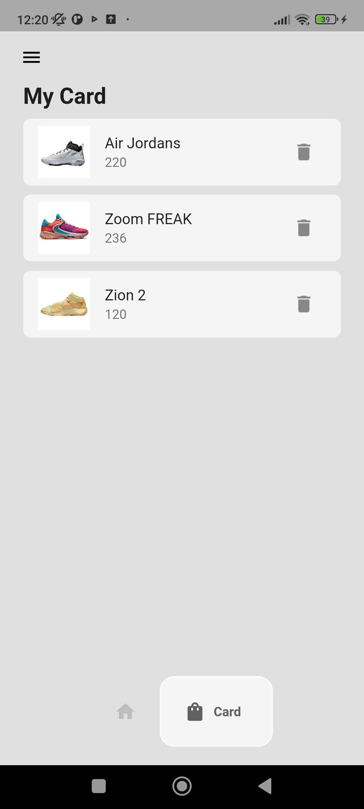
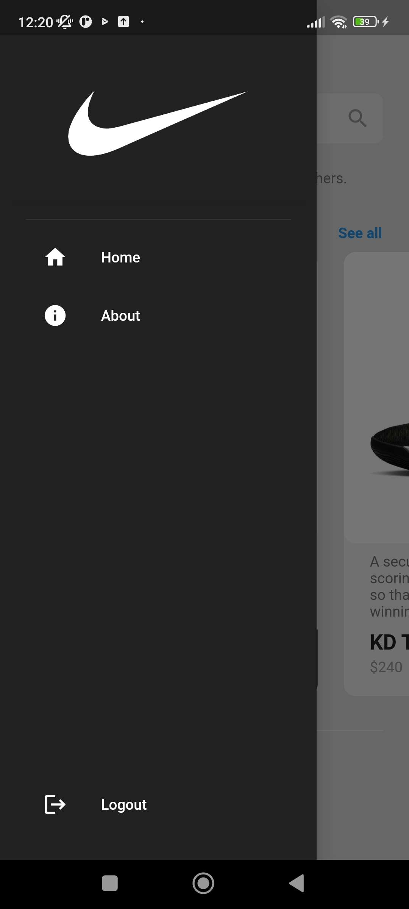

<h1 align="center">Sneaker Shop App</h1>
<p align="center">  
E-commerce app that users can browse through shoes for sale and add them to the card. Users can also remove items from the card.
  </p>

## Screenshots
<table>
    <tr>
    <td>Intro Page</td>
    <td>Shop Page</td>
    <td>Card Page</td>
    <td>Drawer</td>
   </tr> 
  <tr>
 <td></td>
 <td></td>
 <td></td>
 <td></td>
   </tr>  
  </tr>
</table>

## Installation

1. Create a new Flutter project:
  ```shell
  flutter create sneaker_shop_app
  ```

2. Clone the repository:
  ```shell
  git clone https://github.com/GunseliUnsal/sneaker_shop_app.git
  ```

3. Test your changes by running the app on an emulator or a physical device:
  ```shell
  flutter run
  ```


## Packages 

- [google_nav_bar](https://pub.dev/packages/google_nav_bar) -A modern google style nav bar for flutter.
- [provider](https://pub.dev/packages/provider) - It provides a state management technique that is used for managing a piece of data around the app.
